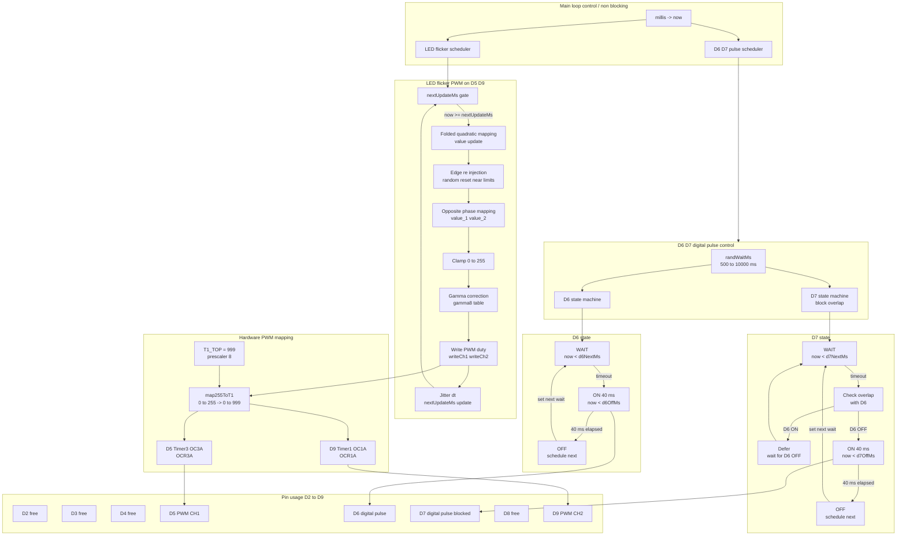

# denki-taki

## 要求仕様
[要求仕様](./docs/requirement.md)は別資料にまとめる。  

## ソフトウェア設計

```mermaid
flowchart TD
  %% =========================
  %% System Overview
  %% =========================
  subgraph SYS[Main loop control / non blocking]
    NOW[millis -> now]
    DOUT[D6 D7 pulse scheduler]
    CANDLE[LED flicker scheduler]
  end

  NOW --> DOUT
  NOW --> CANDLE

  %% =========================
  %% LED Flicker PWM D5 D9
  %% =========================
  subgraph PWM[LED flicker PWM on D5 D9]
    SCH[nextUpdateMs gate]
    FOLD[Folded quadratic mapping\nvalue update]
    EDGE[Edge re injection\nrandom reset near limits]
    PHASE[Opposite phase mapping\nvalue_1 value_2]
    CLAMP[Clamp 0 to 255]
    GAMMA[Gamma correction\ngamma8 table]
    WRITE[Write PWM duty\nwriteCh1 writeCh2]
    JIT[Jitter dt\nnextUpdateMs update]
  end

  CANDLE --> SCH
  SCH -->|now >= nextUpdateMs| FOLD
  FOLD --> EDGE
  EDGE --> PHASE
  PHASE --> CLAMP
  CLAMP --> GAMMA
  GAMMA --> WRITE
  WRITE --> JIT
  JIT --> SCH

  %% =========================
  %% Hardware PWM mapping
  %% =========================
  subgraph HW_PWM[Hardware PWM mapping]
    MAP[map255ToT1\n0 to 255 -> 0 to 999]
    D5[D5 Timer3 OC3A\nOCR3A]
    D9[D9 Timer1 OC1A\nOCR1A]
    TOP[T1_TOP = 999\nprescaler 8]
  end

  WRITE --> MAP
  MAP --> D5
  MAP --> D9
  TOP --> MAP

  %% =========================
  %% Digital output scheduling
  %% =========================
  subgraph DOUT_SM[D6 D7 digital pulse control]
    RND[randWaitMs\n500 to 10000 ms]
    D6SM[D6 state machine]
    D7SM[D7 state machine\nblock overlap]
  end

  DOUT --> DOUT_SM
  RND --> D6SM
  RND --> D7SM

  %% D6 state machine
  subgraph D6STATE[D6 state]
    D6WAIT[WAIT\nnow < d6NextMs]
    D6ON[ON 40 ms\nnow < d6OffMs]
    D6OFF[OFF\nschedule next]
  end

  D6SM --> D6WAIT
  D6WAIT -->|timeout| D6ON
  D6ON -->|40 ms elapsed| D6OFF
  D6OFF -->|set next wait| D6WAIT

  %% D7 state machine
  subgraph D7STATE[D7 state]
    D7WAIT[WAIT\nnow < d7NextMs]
    D7CHECK[Check overlap\nwith D6]
    D7DEFER[Defer\nwait for D6 OFF]
    D7ON[ON 40 ms\nnow < d7OffMs]
    D7OFF[OFF\nschedule next]
  end

  D7SM --> D7WAIT
  D7WAIT -->|timeout| D7CHECK
  D7CHECK -->|D6 ON| D7DEFER
  D7DEFER --> D7WAIT
  D7CHECK -->|D6 OFF| D7ON
  D7ON -->|40 ms elapsed| D7OFF
  D7OFF -->|set next wait| D7WAIT

  %% =========================
  %% Pin usage summary
  %% =========================
  subgraph IO[Pin usage D2 to D9]
    P2[D2 free]
    P3[D3 free]
    P4[D4 free]
    P5[D5 PWM CH1]
    P6[D6 digital pulse]
    P7[D7 digital pulse blocked]
    P8[D8 free]
    P9[D9 PWM CH2]
  end

  D6ON --> P6
  D7ON --> P7
  D5 --> P5
  D9 --> P9
```